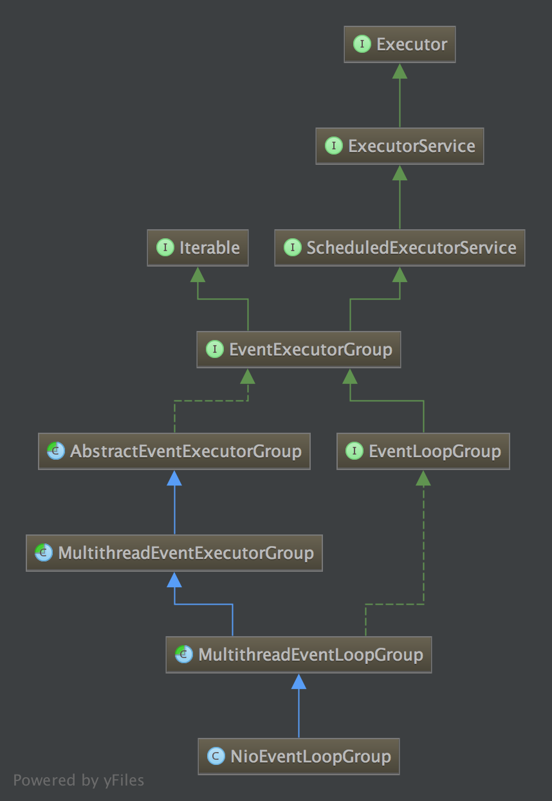

## Netty源码分析之NioEventLoopGroup

@(关键词)[Netty源码分析|NioEventLoopGroup]

从官方给出的demo可以看出，新建一个客户端、服务端的通信，首先都新建了NioEventLoopGroup实例。不同的是客户端新建了一个，而服务端分BossGroup和workerGroup两个实例。那么我们就分析一下，NioEventLoopGroup实例化的过程中都发生了什么。

-------------------

### NioEventLoopGroup类图


从上图可见，NioEventLoopGroup继承于Executor和Iterable，兼具有Executor和Iterable的属性，那么实际的情况是不是这样的呢？我们来看一看
### NioEventLoopGroup初始化
``` java
public NioEventLoopGroup() {
    this(0);
   }
```
``` java
public NioEventLoopGroup(int nThreads, Executor executor, final SelectorProvider selectorProvider,final SelectStrategyFactory selectStrategyFactory) {
        super(nThreads, executor, selectorProvider, selectStrategyFactory, RejectedExecutionHandlers.reject());
    }
``` java
默认构造NioEventLoopGroup时，使用的是无参构造函数（除BossGroup外），这里会默认给一个0。经过跟踪初始化的调用过程，会调用到父类MultithreadEventLoopGroup的构造函数。
```  
protected MultithreadEventLoopGroup(int nThreads, ThreadFactory threadFactory, Object... args) {
        super(nThreads == 0 ? DEFAULT_EVENT_LOOP_THREADS : nThreads, threadFactory, args);
    }
```
``` java
DEFAULT_EVENT_LOOP_THREADS = Math.max(1, SystemPropertyUtil.getInt(
                "io.netty.eventLoopThreads", NettyRuntime.availableProcessors() * 2));
```
当传入的nThreads==0时，会默认使用DEFAULT_EVENT_LOOP_THREADS作为参数，默认为CPU核心数 x 2。
继续看代码，最终会在MultithreadEventExecutorGroup中做初始化操作。初始化的代码如下：
``` java
protected MultithreadEventExecutorGroup(int nThreads, Executor executor,EventExecutorChooserFactory chooserFactory, Object... args) {
        if (nThreads <= 0) {
            throw new IllegalArgumentException(String.format("nThreads: %d (expected: > 0)", nThreads));
        }
        if (executor == null) {
            executor = new ThreadPerTaskExecutor(newDefaultThreadFactory());
        }
        children = new EventExecutor[nThreads];
        for (int i = 0; i < nThreads; i ++) {
            boolean success = false;
            try {
                children[i] = newChild(executor, args);
                success = true;
            } catch (Exception e) {
                // TODO: Think about if this is a good exception type
                throw new IllegalStateException("failed to create a child event loop", e);
            } finally {
                if (!success) {
                    for (int j = 0; j < i; j ++) {
                        children[j].shutdownGracefully();
                    }
                    for (int j = 0; j < i; j ++) {
                        EventExecutor e = children[j];
                        try {
                            while (!e.isTerminated()) {
                                e.awaitTermination(Integer.MAX_VALUE, TimeUnit.SECONDS);
                            }
                        } catch (InterruptedException interrupted) {
                            // Let the caller handle the interruption.
                            Thread.currentThread().interrupt();
                            break;
                        }
                    }
                }
            }
        }
        chooser = chooserFactory.newChooser(children);
        final FutureListener<Object> terminationListener = new FutureListener<Object>() {
            @Override
            public void operationComplete(Future<Object> future) throws Exception {
                if (terminatedChildren.incrementAndGet() == children.length) {
                    terminationFuture.setSuccess(null);
                }
            }
        };

        for (EventExecutor e: children) {
            e.terminationFuture().addListener(terminationListener);
        }

        Set<EventExecutor> childrenSet = new LinkedHashSet<EventExecutor>(children.length);
        Collections.addAll(childrenSet, children);
        readonlyChildren = Collections.unmodifiableSet(childrenSet);
    }
```
该部分初始化的主要工作，是对MultithreadEventExecutorGroup类中维护的EventExecutor[]类型的数组的初始化，但是创建EventExecutor的newChild()方法是一个抽象方法：
``` java
protected abstract EventExecutor newChild(Executor executor, Object... args) throws Exception
```
``` java
@Override
protected EventLoop newChild(Executor executor, Object... args) throws Exception {
        return new NioEventLoop(this, executor, (SelectorProvider) args[0],
            ((SelectStrategyFactory) args[1]).newSelectStrategy(), (RejectedExecutionHandler) args[2]);
    }
```
该方法在会在子类NioEventLoopGroup被重写，代码中可见，EventExecutor[]实际维护的其实是一个NioEventLoop的数组。
另外需要注意的是，调用newChild()方法的时的参数executor。该参数在在初始化时，应该==null，因此在代码中，会新建一个ThreadPerTaskExecutor(newDefaultThreadFactory())，跟踪进去看看这个类有什么特别的地方
``` java
public final class ThreadPerTaskExecutor implements Executor {
    private final ThreadFactory threadFactory;

    public ThreadPerTaskExecutor(ThreadFactory threadFactory) {
        if (threadFactory == null) {
            throw new NullPointerException("threadFactory");
        }
        this.threadFactory = threadFactory;
    }
    @Override
    public void execute(Runnable command) {
        threadFactory.newThread(command).start();
    }
}
```
根据代码判断，起关键作用应该是它构造函数的参数threadFactory，这个参数是一个创建线程的工厂类，如果调用ThreadPerTaskExecutor的execute方法，就会创建一个新的线程执行里面的command指令。
>**注意：** 这个executor在初始化EventLoop的时候当作参数传进去，在EventLoop中会起到启动nio线程的作用

------
下一节待续：NioEventLoop

